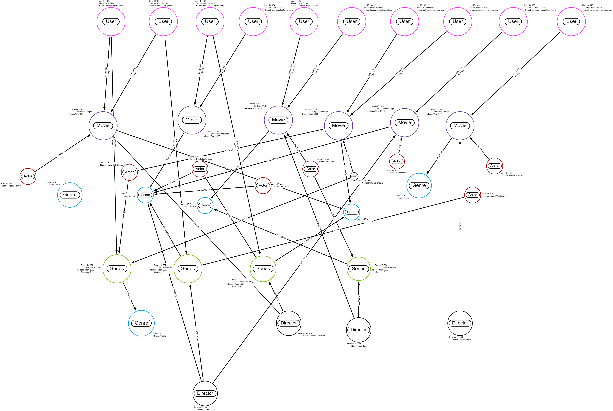

# 🎬 Streaming Service - Graph Database Model

*Modelagem de dados em grafos com Neo4j e Cypher*


Projeto de **modelagem de dados em grafos** desenvolvido durante o 
**Bootcamp Neo4j — Análise de Dados com Grafos**, da DIO.

O projeto utiliza **Neo4j e Cypher** para representar o domínio de uma 
plataforma de streaming através de nós, propriedades e relacionamentos.

O modelo permite explorar conexões entre:

**Usuários → Filmes/Séries → Gêneros → Atores → Diretores**

e utilizar essas relações para realizar consultas e explorar possibilidades 
de recomendação de conteúdo.

---

## 🎯 Objetivo

Construir um modelo de banco de dados orientado a grafos capaz de representar 
as principais entidades e relacionamentos existentes em uma plataforma de streaming.

O projeto explora conceitos como :

- Graph Databases
- Neo4j
- Cypher Query Language
- Modelagem de dados
- Nós e relacionamentos
- Propriedades
- Constraints
- Integridade de dados
- Consultas em grafos
- Sistemas de recomendação baseados em relacionamentos

---

## 🧠 Por que utilizar Grafos?

Em um banco relacional tradicional, informações relacionadas podem exigir diversas 
operações de JOIN.

Em um banco de grafos, as relações fazem parte diretamente do modelo :

```text
Usuário
   ↓
ASSISTIU
   ↓
Filme
   ↓
PERTENCE_A
   ↓
Gênero
```

Isso permite navegar naturalmente pelas conexões existentes entre os dados.

Em uma plataforma de streaming, essa abordagem é especialmente interessante porque 
grande parte do valor dos dados está justamente nas relações entre usuários, 
conteúdos, gêneros, atores e diretores.

---

## 🏗️ Modelo de Dados

O modelo utiliza seis principais tipos de nós.


`User` - Usuários da plataforma 

`Movie` - Filmes disponíveis 

`Series` - Séries disponíveis 

`Genre` - Gêneros dos conteúdos 

`Actor` - Atores e atrizes 

`Director` - Diretores 

---

## 🔗 Relacionamentos


`WATCHED` - Usuário assistiu determinado conteúdo 

`ACTED_IN` - Ator participou de um filme ou série

`DIRECTED` - Diretor dirigiu determinado conteúdo

`IN_GENRE` - Conteúdo pertence a determinado gênero

O relacionamento `WATCHED` também pode armazenar propriedades, como a avaliação 
atribuída pelo usuário.

---

## 🖼️ Diagrama do Modelo

<p align="center">
  
</p>

O diagrama apresenta visualmente as entidades e conexões utilizadas na modelagem 
da plataforma.

---

## 📊 Dataset

O modelo foi populado com dados demonstrativos para permitir a execução das consultas.


Usuários - 10

Filmes - 6

Séries - 4 

Gêneros - 6 

Atores - 8 

Diretores - 5 

**Total de Nós** - **39**

**Relacionamentos** - **44**

---

## 🔐 Constraints e Integridade

O modelo utiliza constraints para garantir a unicidade dos identificadores das 
principais entidades.

Exemplos:

User → userId
Movie → movieId
Series → seriesId
Genre → genreId

Isso evita duplicidades e contribui para a consistência dos dados armazenados no grafo.

---

## 🔎 Consultas com Cypher

O arquivo `Consultas.Cypher` reúne consultas utilizadas para explorar o modelo.

As consultas permitem trabalhar conceitos como:

- Navegação entre nós
- Filtragem
- Relacionamentos
- Agregações
- Padrões no grafo
- Preferências dos usuários
- Exploração de conteúdos relacionados
- Recomendações

---

## 🎯 Sistemas de Recomendação

Uma das aplicações mais interessantes de bancos de grafos em plataformas de 
streaming é a construção de recomendações baseadas em relacionamentos.

Um fluxo conceitual pode ser representado por:

Usuário
   ↓
Conteúdos Assistidos
   ↓
Gêneros Preferidos
   ↓
Usuários com Comportamento Semelhante
   ↓
Outros Conteúdos
   ↓
Recomendação

A estrutura em grafo facilita a exploração dessas conexões e a identificação 
de padrões entre usuários e conteúdos.

---

## 🛠️ Tecnologias

| Tecnologia | Aplicação |
|---|---|
| **Neo4j** | Banco de dados orientado a grafos |
| **Cypher** | Criação e consulta do grafo |
| **Arrows** | Modelagem visual |
| **Git** | Versionamento |
| **GitHub** | Repositório e documentação |

---

## 📂 Estrutura do Repositório

Streaming-Graph-Model/
│
├── Modelo.Cypher
├── Consultas.Cypher
├── Meu_Diagrama_Streaming.png
└── README.md

---

## ▶️ Como Executar

### 1. Configure o Neo4j

Utilize uma instância compatível do Neo4j.

### 2. Crie o banco

Crie uma nova base para executar o modelo.

### 3. Execute o modelo

Abra:

Modelo.Cypher

e execute os comandos para criação das constraints, nós, propriedades e relacionamentos.

### 4. Execute as consultas

Depois de popular o grafo, utilize:

Consultas.Cypher

para explorar os dados e relacionamentos.

---

## 💡 Competências Demonstradas

- Neo4j
- Cypher Query Language
- Graph Databases
- NoSQL
- Data Modeling
- Graph Data Modeling
- Constraints
- Integridade de dados
- Consultas em grafos
- Análise de relacionamentos
- Modelagem de domínios
- Fundamentos de Recommendation Systems
- Git e GitHub

---

## 🚀 Possíveis Evoluções

O modelo pode evoluir incorporando:

- Episódios
- Temporadas
- Estúdios
- Países
- Premiações
- Histórico temporal de visualização
- Preferências dos usuários
- Listas pessoais
- Similaridade entre usuários
- Algoritmos de recomendação
- Community Detection
- PageRank
- Graph Data Science
- Machine Learning aplicado a grafos

Uma evolução natural seria utilizar a **Neo4j Graph Data Science Library** para 
explorar algoritmos sobre o grafo e construir modelos mais avançados de recomendação.

---

## 🎓 Contexto Acadêmico

Projeto desenvolvido durante o **Bootcamp Neo4j — Análise de Dados com Grafos**, 
da DIO.

**Disciplina:** Fundamentos de Neo4j  
**Professor:** Matheus Ferreira  
**Período:** Primeiro semestre de 2026

O desafio teve como objetivo aplicar conceitos de modelagem de dados em grafos, 
Cypher, constraints, relacionamentos e consultas a um domínio próximo de uma 
aplicação real.

---

## 👨‍💻 Autor

**Marcus Guedes**

Marketing | Data Science | Inteligência Artificial | Gestão de Projetos

GitHub: MCLG1661  
LinkedIn: Marcus Guedes

---

🎬 **Transformando dados em conexões e conexões em conhecimento.**
